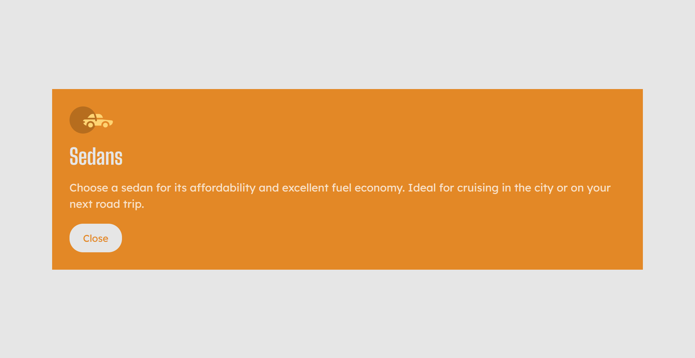

# 3-column-cards

A responsive 3-column cards component displaying car categories information.

User is able to:
- View the optimal layout depending on device's screen size
- See hover states for button element
- View the expanded card on button click event

## Tech Stack

**Frontend:** HTML5, Sass, CSS3, JS

## Features

- Responsive Design
- Displayed as stack on mobile and tablet width
- Displayed as queue on desktop width

## Process

Started with a single card structure in HTML and style it with SASS. Then copy the HTML to create 2 more cards with different background colors. Finally added JavaScript code to handle button click event to expand the clicked card.
## Learnings

Learned to use SASS (a pre-processor scripting language) to write CSS styles which are then compiled into CSS file. 

It comes with many features that makes writing CSS much convieient and easier to understand.
## Running the Project

Copy the code in your editor OR download the zip file and open index.html

## Screenshots

